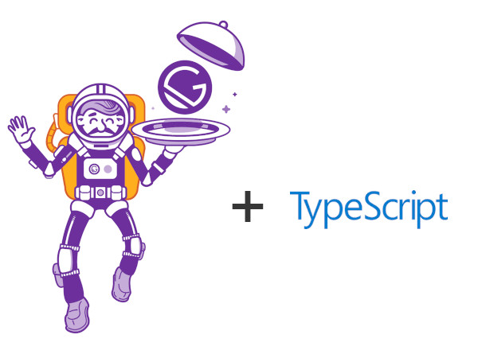

# gatsby-typescript-boilerplate
Opinionated [Gatsby](https://www.gatsbyjs.org/) with [TypeScript](https://www.typescriptlang.org/) boilerplate. 

## Features
* Offline support.
* Fav Icons for various devices.
* PWA(Progressive Web Application).
* SCSS(CSS with superpowers).
* BootChat(Crisp Chat).
* React Native Web(React Native components and APIs on the web using React DOM.).

## Built With
* [Gatsby V2](https://www.gatsbyjs.org/)
* [TypeScript](https://www.typescriptlang.org/)
* [SCSS (SASS)](https://sass-lang.com/)
* [react-helmet](https://www.npmjs.com/package/react-helmet)
* [postcss](https://github.com/postcss)
* [react-native-web](https://github.com/necolas/react-native-web)
* [postcss](https://crisp.chat/)

## Gatsby Plugins
* [gatsby-plugin-favicon](https://www.npmjs.com/package/gatsby-plugin-favicon)
* [gatsby-source-filesystem](https://www.npmjs.com/package/gatsby-source-filesystem)
* [gatsby-plugin-offline](https://www.npmjs.com/package/gatsby-plugin-offline)
* [gatsby-plugin-tslint](https://www.npmjs.com/package/gatsby-plugin-tslint)
* [gatsby-plugin-sharp](https://www.npmjs.com/package/gatsby-plugin-sharp)
* [gatsby-transformer-sharp](https://www.npmjs.com/package/gatsby-transformer-sharp)
* [gatsby-plugin-manifest](https://www.npmjs.com/package/gatsby-plugin-manifest)
* [gatsby-image](https://www.npmjs.com/package/gatsby-image)
* [gatsby-react-native-web](https://www.npmjs.com/package/gatsby-react-native-web)
* [gatsby-sitemap](https://www.npmjs.com/package/gatsby-sitemap)
* [gatsby-manifest](https://www.npmjs.com/package/gatsby-manifest)
* [gatsby-sass](https://www.npmjs.com/package/gatsby-sass)
* [gatsby-googl-analytics](https://www.npmjs.com/package/gatsby-googl-analytics)
* [gatsby-canonical-urls](https://www.npmjs.com/package/gatsby-canonical-urls)
* [gatsby-robots](https://www.npmjs.com/package/gatsby-robots)
* [gatsby-crisp-chat](https://www.npmjs.com/package/gatsby-crisp-chat)

## TS Lint Plugins
* [tslint-config-airbnb](https://www.npmjs.com/package/tslint-config-airbnb)
* [tslint-config-prettier](https://www.npmjs.com/package/tslint-config-prettier)
* [tslint-plugin-prettier](https://www.npmjs.com/package/tslint-plugin-prettier)

## Other Plugins
* [autoprefixer](https://www.npmjs.com/package/autoprefixer)
* [CSS nano](https://github.com/cssnano/cssnano)
* [Prettier](https://www.npmjs.com/package/prettier)
* [Stylelint](https://www.npmjs.com/package/stylelint)
* [CSS MQ Packer](https://www.npmjs.com/package/css-mqpacker)
